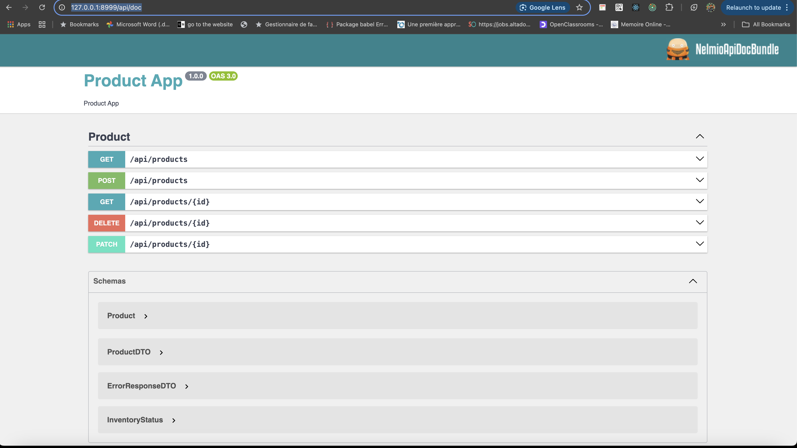

# Product Management

## Overview

This application is designed to manage products.

## Pre-requirements

- Docker with compose plugin
- Make

## Technical Stack

- **Symfony**: v7.1
- **PHP**: v8.3
- **Mysql**: v8.0.33

## Getting Started

1. **Clone the application**:
   ```
     git clone https://github.com/SoufianLa/productTrial.git
   ```

2. **Installation**:

    - Using make:
      ```
       make docker-up &&
       make database-create &&
       make composer-install &&
       make run-migrations
       ```

3. **Test the application**:
   ```
     make database-test-create && make test-all
     ```
   ```bash
     Testing 
     Product Controller (App\Tests\Functionnal\Controller\ProductController)
     ✔ Create product
     ✔ Get products
     ✔ Get product details
     ✔ Update product
     ✔ Delete product

     Product Service (App\Tests\Unit\Service\ProductService)
     ✔ Add product
     ✔ Update product
     ✔ Remove product
     ✔ Get products

     Time: 00:00.658, Memory: 10.00 MB
   ```

4. **Start Using the application**:
    - For Browser API Testing (openAPI):
    ```
      http://127.0.0.1:8999/api/doc
    ```
   